SENTINEL
A Deterministic State Engine for Security

* SIM (Security Incident Manager) — Deterministic SOC State Engine
A deterministic, state-driven SOC incident engine built on top of Wazuh telemetry, with a causality engine and time-aware global context.
SIM ingests security events into structured state, correlates activity across time windows, and manages incidents through controlled, rule-based lifecycle logic. Threat intelligence is resolved locally and offline — MITRE ATT&CK, CVE/NVD, protocols, and services — with no external dependencies.
Jarvis, the AI interpretation layer, receives a deterministic report from the engine and summarizes findings with recommended next steps. It is never the source of security truth.
The platform is AI-agnostic by design. Swapping to a better local model requires no architectural changes.



---

SIM treats incidents as stateful objects, not temporary alerts.


## Why SIM Exists

Most SOC workflows are dashboard-driven.

Dashboards are excellent for visibility.  
They are weak for maintaining structured, persistent state.

Alerts appear.
Analysts click.
Context lives in multiple places.

SIM treats security reasoning as a stateful system:

- Events are stored as structured data
- Incidents evolve through controlled lifecycle transitions
- Correlation operates across time windows
- MITRE mapping is deterministic and offline
- Decisions are auditable

The goal is simple:

> Reduce alert fatigue and make security reasoning reproducible.

---

## Core Capabilities

- Telemetry ingestion from Wazuh indexer
- Structured SQLite state (events, facts, incidents, decisions)
- Local MITRE ATT&CK v18.1 pinning and many more (offline lookup)
- Time-window attack chain correlation
- Deterministic incident promotion
- Controlled state transitions (no duplicate open incidents)
- CLI and API interfaces
- AI-assisted triage explanations (non-authoritative)

---

## Architecture Overview

Wazuh Agents  
→ Wazuh Manager / Indexer  
→ SIM Ingestion Layer  
→ Structured State (SQLite)  
→ Correlation & Policy Engine  
→ Incident Lifecycle Management  
→ AI Interpretation Layer

Deterministic core first.  
Language model second.

---

## Design Principles

- Security truth must be deterministic
- State must be auditable and reproducible
- Rule-based logic precedes probabilistic AI
- Incident lifecycle must move forward consistently
- Separation between reasoning engine and language model

## System Boundaries

SIM is not:

- A SIEM replacement
- A log storage platform
- A probabilistic AI decision engine

SIM is:

- A deterministic reasoning layer
- A structured incident state manager
- A correlation and lifecycle control engine

---

## Project Structure

```text
 ~/platform❯ tree -L 3
.
├── 11-03 to do list.txt
├── app
│   ├── adapter
│   │   └── jarvis_openai_adapter.py
│   ├── data
│   │   └── appsim.db
│   ├── Dockerfile
│   ├── entrypoint.sh
│   ├── jarvis
│   │   ├── __init__.py
│   │   ├── jarvis_memory.py
│   │   ├── jarvis.py
│   │   └── __pycache__
│   ├── requirements.txt
│   ├── scripts
│   │   └── sim
│   └── sim
│       ├── api.py
│       ├── brief.py
│       ├── causality.py
│       ├── chains.py
│       ├── cli.py
│       ├── compositor.py
│       ├── data
│       ├── db.py
│       ├── enrich.py
│       ├── hypotheses.py
│       ├── incidents.py
│       ├── ingest
│       ├── __init__.py
│       ├── kpi.py
│       ├── llm.py
│       ├── mitre.py
│       ├── models.py
│       ├── normalise.py
│       ├── policy.py
│       ├── prompt.py
│       ├── __pycache__
│       ├── report.py
│       ├── state.py
│       ├── time_intent.py
│       ├── tools
│       └── triage.py
├── certs
│   ├── admin-key.pem
│   ├── admin.pem
│   ├── ca.pem
│   ├── client-key.pem
│   ├── client.pem
│   └── root-ca.pem
├── compositor.py
├── compositor_wiring.py
├── data
│   ├── appsim.db
│   ├── appsim.db.bak.1773072275
│   ├── appsim.db.bak.1773077032
│   ├── jarvis_memory.db
│   ├── jarvis_memory.db-shm
│   ├── jarvis_memory.db-wal
│   └── reports
│       └── latest_24h.json
├── docker-compose.yml
├── intel-data
│   ├── attack
│   │   ├── metadata.json
│   │   ├── normalize_attack.py
│   │   ├── normalized
│   │   ├── raw
│   │   └── SHA256SUMS.txt
│   ├── capec
│   │   ├── metadata.json
│   │   ├── normalized
│   │   ├── raw
│   │   └── SHA256SUMS.txt
│   ├── cve
│   │   ├── metadata.json
│   │   ├── normalized
│   │   ├── raw
│   │   └── SHA256SUMS.txt
│   ├── cwe
│   │   ├── metadata.json
│   │   ├── normalized
│   │   ├── raw
│   │   └── SHA256SUMS.txt
│   ├── nvd
│   │   ├── metadata.json
│   │   ├── normalized
│   │   ├── raw
│   │   └── SHA256SUMS.txt
│   ├── protocols
│   │   ├── metadata.json
│   │   ├── normalized
│   │   └── raw
│   ├── rfcs
│   │   ├── metadata.json
│   │   ├── normalized
│   │   └── raw
│   ├── security-notes
│   │   ├── metadata.json
│   │   ├── normalized
│   │   └── raw
│   └── services
│       ├── metadata.json
│       ├── normalized
│       └── raw
├── __pycache__
│   └── jarvis.cpython-312.pyc
├── services
│   └── intel_services
│       ├── app
│       ├── Dockerfile
│       ├── network_lookup.py
│       ├── __pycache__
│       ├── requirements.txt
│       └── test_network_lookup.py
└── soc_platform_architecture_v2.svg

48 directories, 68 files
